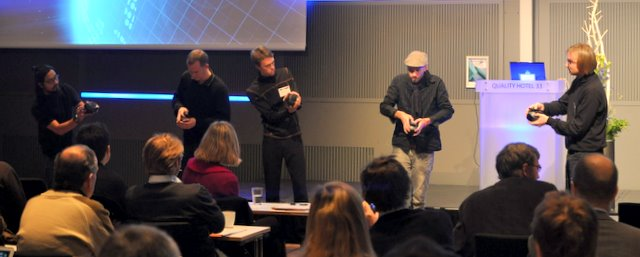

# Oslo Mobile Orchestra

A collection of patches used with [Oslo Mobile Orchestra (OMO)](https://www.uio.no/ritmo/english/research/labs/fourms/research/projects/omo/) at the Department of Musicology, University of Oslo.

OMO used to work with a collection of patches developed in PureData and deployed via MobMuPlat. This collection uses browser-based apps that rely on the Web Audio API. They should work on both iOS and Android phones, although there may be variations in sensors available and browser capabilities.

**Play now:** [fourms.github.io/omo/](https://fourms.github.io/omo/)

## Browsers

The apps should (in theory) work in all modern browsers, but we have found they generally work best with **Safari on iPhone/iPad** and **Chrome on Android**. Open the site in the browser — not inside Instagram, email, or other in-app browsers (use “Open in browser” if needed).

## Quick start

1. Open the hub and pick an instrument — each card lists **synthesis** and **sensors** (58 apps in six sections).
2. Turn **Audio on** (top right) if sound does not start on first touch.
3. Tap **Learn** for how to play; **QR** shares a link to the same app for the group.
4. Allow **microphone**, **motion**, or **camera** when prompted (browser and OS settings).
5. Use the **Volume** bar under the header (**50%–150%**, default 100%) to match loud/quiet phones; also raise system volume and disable silent mode on iPhone.
6. **Add to Home Screen** for a more full-screen, offline-friendly install.

### Playing surfaces

Many apps use a similar layout:

| Pattern | Examples | How to play |
|---------|----------|-------------|
| **Full pad / X–Y** | Kaoss Pad, FM Touch, Pinch Bass | Drag on the large pad |
| **Centre record button** | Sampler, Scrub Tape, Wind Bottle, Vocoder Choir | Hold the round button (mic apps record; release to loop or stop) |
| **Hold pad** | Shepard Glide, many drones | Keep finger down; tilt shapes sound |
| **Keyboard / sequencer** | Piano, Markov Melody, drum sequencers | Tap keys or steps |

Live readouts (filter Hz, position, training stats) stay visible at the top of the play area where relevant.

## Instruments

Compact list — full tables with folder names: **[docs/CATALOG.md](docs/CATALOG.md)**.

| | |
|---|---|
| **Rhythm** (11) | [CliX](apps/clix/) · [Conductor](apps/conductor/) · [Drumkit](apps/drumkit/) · [Drum Sequencer](apps/drum-sequencer/) · [Circular Drum](apps/circular-drum/) · [Firefly](apps/firefly/) · [Delay Throw](apps/delay-throw/) · [Euclidean Rings](apps/euclidean-rings/) · [L-System Groove](apps/lsystem-groove/) · [Clap Architect](apps/clap-architect/) · [Shadow Sequencer](apps/shadow-sequencer/) |
| **Drones** (11) | [Green Button](apps/green-button/) · [Just Equal](apps/just-equal/) · [Sound Saber](apps/sound-saber/) · [Motion Trump](apps/motion-wah/) · [Compass Wah](apps/compass-wah/) · [Harmonizer](apps/harmonizer/) · [Shepard Glide](apps/shepard-glide/) · [Shake Filter](apps/shake-filter/) · [Flat Edge](apps/flat-edge/) · [Heading Choir](apps/heading-choir/) · [Swarm Bloom](apps/swarm-bloom/) |
| **Melody** (9) | [Piano](apps/piano/) · [Mic Theremin](apps/mic-theremin/) · [Flute Blow](apps/flute-blow/) · [Tilt Harp](apps/tilt-harp/) · [Bow Phone](apps/bow-phone/) · [Markov Melody](apps/markov-melody/) · [Kaoss Pad](apps/kaoss-pad/) · [Bowed Waveguide](apps/bowed-waveguide/) · [Crystalis](apps/crystalis/) |
| **Synthesis** (12) | [FM Touch](apps/fm-touch/) · [FM Matrix](apps/fm-matrix/) · [KS String](apps/ks-string/) · [Additive Bells](apps/additive-bells/) · [Filter Ladder](apps/filter-ladder/) · [Ring Mod Gong](apps/ring-mod-gong/) · [Pinch Bass](apps/pinch-bass/) · [Edge Strum](apps/edge-strum/) · [Am Radio](apps/am-radio/) · [Phase Distortion](apps/phase-distortion/) · [Supersaw Stack](apps/supersaw-stack/) · [Pluck Bowl](apps/pluck-bowl/) |
| **Texture** (11) | [Sampler](apps/sampler/) · [Granular Tilt](apps/granular-tilt/) · [Spectral Freeze](apps/spectral-freeze/) · [Tap Bloom](apps/tap-bloom/) · [Wavetable Scan](apps/wavetable-scan/) · [Video Sonifier](apps/video-sonifier/) · [Chaos Attractor](apps/chaos-attractor/) · [Room Reverb Send](apps/room-reverb-send/) · [Wind Bottle](apps/wind-bottle/) · [Scrub Tape](apps/scrub-tape/) · [Vocoder Choir](apps/vocoder-choir/) |
| **AI** (4) | [Evo Drumkit](apps/evo-drumkit/) · [Hum Clap](apps/hum-clap/) · [Train Shake](apps/train-shake/) · [Gesture Regression](apps/gesture-regression/) |

## Documentation

| Resource | Contents |
|----------|----------|
| [App catalog](docs/CATALOG.md) | All hub apps by section (synthesis · sensors · folder slug) |
| [Workshop guide](docs/WORKSHOP-GUIDE.md) | 45-minute facilitator script |
| [Ideas](docs/IDEAS.md) | Backlog and shipped history |
| [Device support](support.html) | Sensor API checklist before workshops |
| [Wiki](https://github.com/fourMs/omo/wiki) | Extended workshop material ([`docs/wiki/`](docs/wiki/)) |

## License

[GPL-3.0](LICENSE)
